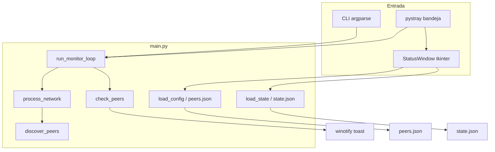

# Network Monitor — Spec do Projeto

Monitor de peers **Radmin VPN** e **LAN** para Windows. Faz ping periódico, detecta online/offline, descobre peers na sub-rede e envia notificações toast.

## Stack e restrições

| Item | Detalhe |
|------|---------|
| Linguagem | Python 3.10+ (`from __future__ import annotations`) |
| Plataforma | **Windows apenas** — usa `winreg`, `ping -n`, `winotify`, `CREATE_NO_WINDOW` |
| UI | `tkinter` (painel) + `pystray` (bandeja) |
| Dependências | `winotify`, `pystray`, `Pillow` — ver `requirements.txt` |
| Idioma da UI | Português (mensagens, logs, notificações) |

Não portar para Linux/macOS sem pedido explícito. Não substituir `ping` por bibliotecas externas sem motivo.

## Estrutura de arquivos

```
main.py          # Lógica central: config, ping, descoberta, monitor, CLI, bandeja
gui.py           # StatusWindow (tkinter) — importa funções de main sob demanda
peers.json       # Configuração (gerado na 1ª execução; gitignored)
state.json       # Estado online/offline por IP (gitignored)
monitor.log      # Log persistente (gitignored)
requirements.txt
```

**Regra de imports:** `gui.py` importa de `main` **dentro das funções** (evita import circular). `main.py` importa `gui` só em `run_with_tray()` e `--gui`.

## Arquitetura



### Threads

- **Monitor** (`run_monitor_loop`): thread daemon `radmin-monitor`
- **GUI** (`StatusWindow`): thread daemon `radmin-gui` com loop tkinter próprio
- **Bandeja** (`pystray.Icon.run`): thread principal ao iniciar sem flags

Ao encerrar: `stop_event.set()` → fechar GUI → `icon.stop()` → `monitor_thread.join(timeout=5)`.

## Modelos de dados

### `Peer` (dataclass)

```python
ip: str
name: str
network_name: str = ""
network_type: str = "radmin"  # "radmin" | "lan"
hidden: bool = False          # não monitora, não notifica
muted: bool = False           # monitora, sem notificação
online: bool | None = None    # runtime only
```

### `peers.json`

```json
{
  "interval_seconds": 15,
  "auto_discover": true,
  "scan_interval_seconds": 300,
  "notifications_enabled": true,
  "peer_order": ["26.0.0.2"],
  "networks": [
    {
      "name": "Radmin VPN",
      "type": "radmin",
      "enabled": true,
      "auto_discover": true,
      "peers": [
        { "name": "PC-Amigo", "ip": "26.0.0.2", "hidden": false, "muted": false }
      ]
    }
  ]
}
```

- `peer_order`: ordem na GUI; visíveis antes de ocultos
- `auto_discover` global é fallback quando a rede não define o campo
- Peers ocultos/silenciados: chaves omitidas = `false`

### `state.json`

Mapa `{ "ip": true|false }`. Peers ocultos são removidos ao salvar.

## Redes e detecção de IP

| Tipo | Detecção | Prefixo / regra |
|------|----------|-----------------|
| `radmin` | Registro `Famatech\RadminVPN\1.0` → `IPv4`, fallback `ipconfig` | IPs `26.*` |
| `lan` | Socket UDP para 8.8.8.8, fallback `ipconfig` | RFC1918, exclui Radmin/APIPA |

Constantes em `main.py`:
- `RADMIN_GATEWAYS = {"26.0.0.1"}` — ignorado no scan Radmin
- `LAN_SKIP_PREFIXES = ("169.254.",)` — link-local
- Sub-rede sempre `/24` via `subnet_for_ip()`

## Monitoramento

1. `process_network()` por rede habilitada
2. Auto-descoberta se `auto_discover` e intervalo `scan_interval_seconds` elapsed (ou lista vazia)
3. `discover_peers()`: ping paralelo (32 workers, timeout 800ms) + `resolve_hostname()` via `ping -a`
4. `check_peers()`: ping paralelo (16 workers); notifica só em **transição** e se não `muted`
5. `save_state()` após cada ciclo

Ping usa `subprocess` com `ping -n 1 -w {timeout_ms}`; sucesso = `"ttl="` na saída.

## CLI

| Flag | Ação |
|------|------|
| *(sem flag)* | Bandeja + monitor em background |
| `--run` | Só loop de monitor (startup do Windows) |
| `--gui` | Monitor + painel tkinter |
| `--scan` | Scan único sub-rede Radmin |
| `--scan-lan` | Scan único LAN |
| `--scan-all` | Ambos |
| `--status` | Status no terminal |
| `--install` / `--uninstall` | Registro `HKCU\...\Run` (`RadminMonitor`) |

Startup usa `pythonw.exe` + `--run`. VBS legado em `%APPDATA%\...\Startup\RadminMonitor.vbs` é removido no install.

## GUI (`gui.py`)

- `StatusWindow`: Treeview com drag-and-drop para reordenar peers
- Refresh a cada 3s (`REFRESH_MS`); lê `load_config()` + `load_state()`
- Ações via `main`: `update_peer_name`, `set_peer_hidden`, `set_peer_muted`, `move_peer`, `save_peer_order`, `set_notifications_enabled`
- Renomear: duplo-clique ou F2; Enter confirma, Escape cancela
- Cores em `COLORS` — verde online, vermelho offline, cinza oculto

Singleton: `status_window = StatusWindow()`.

## Convenções de código

1. **Escopo mínimo** — alterações focadas; não refatorar sem pedido
2. **Persistência JSON** — sempre `indent=2`, `ensure_ascii=False`; ler → modificar → escrever atômico no mesmo fluxo
3. **Logging** — `logging.info` para eventos de usuário; `logging.debug` para supressão de notificações
4. **Subprocess Windows** — `creationflags=subprocess.CREATE_NO_WINDOW` em comandos ping/ipconfig
5. **Tipagem** — dataclasses + type hints; `bool | None` para estado desconhecido
6. **Sem testes automatizados** — não adicionar a menos que solicitado
7. **Sem README/docs extras** — a menos que solicitado

## Onde implementar mudanças comuns

| Pedido | Onde editar |
|--------|-------------|
| Novo campo em peer/rede | `Peer`/`NetworkConfig`, `load_config()`, funções `set_*`/`update_*`, GUI columns |
| Nova rede (tipo) | `get_local_ip()`, `skip_ips_for_network()`, `save_default_config()`, parser se CLI novo |
| Alterar intervalo padrão | `save_default_config()` + defaults em `load_config()` |
| Nova notificação | `notify()` ou `check_peers()` |
| Item de menu bandeja | `run_with_tray()` menu `pystray.Menu` |
| Nova ação na GUI | método em `StatusWindow` + callback para função em `main.py` |

## Armadilhas conhecidas

- **Import circular:** nunca importar `gui` no top-level de `main.py` (exceto lazy dentro de funções)
- **Peers ocultos:** excluídos de `check_peers` monitorados e de `save_state`
- **Peers silenciados:** ainda aparecem online/offline; só suprimem toast
- **Descoberta duplicada:** `known_global_ips` evita re-adicionar IPs já em outra rede
- **Edição na GUI durante refresh:** `_refresh_data` adia refresh se `_edit_entry` ou drag ativo
- **Arquivos gitignored:** `peers.json`, `state.json`, `monitor.log` — não commitar

## Execução local

```bash
pip install -r requirements.txt
python main.py              # bandeja (modo normal)
python main.py --status     # diagnóstico rápido
python main.py --scan-all   # popular peers.json
```

Para debug do loop sem bandeja: `python main.py --run` (logs em `monitor.log`).

## Checklist antes de entregar mudanças

- [ ] Funciona só no Windows (sem quebrar APIs winreg/subprocess)
- [ ] `peers.json` / `state.json` permanecem compatíveis com configs existentes
- [ ] GUI continua thread-safe (callbacks via `root.after`)
- [ ] Textos em português
- [ ] Sem dependências novas desnecessárias

## Referência adicional

- Exemplos completos de `peers.json` e `state.json`: [reference.md](reference.md)
- Convenções de commit do repositório: [reference.md#convenções-de-commit](reference.md)
