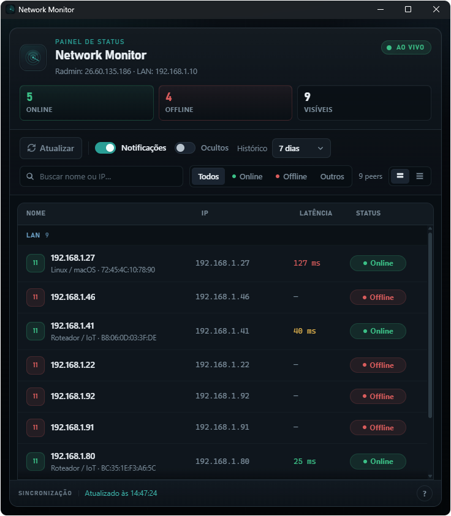

# Network Monitor

Monitor de peers **Radmin VPN** e **LAN** no Windows. Faz ping periódico, descobre dispositivos na sub-rede `/24`, notifica quando alguém fica online ou offline e registra histórico de presença.

## Demo do painel



A UI em `python/ui/` roda no browser com dados fictícios (sem ping real):

1. Sirva a pasta e abra com `?demo=1`, por exemplo:
   ```powershell
   cd python\ui
   python -m http.server 8080
   ```
   Depois abra http://localhost:8080/?demo=1
2. **GitHub Pages** — workflow `.github/workflows/pages.yml` publica a mesma UI em  
   https://guilhermeroesler.github.io/NetworkMonitor/  
   (Pages em repositório **privado** exige plano pago; com repo **público** basta ativar *Settings → Pages → Source: GitHub Actions*.)

## Requisitos

- Windows
- Python 3.10+ (versão principal)
- [WebView2 Runtime](https://developer.microsoft.com/microsoft-edge/webview2/) (painel Python; já incluso na maioria dos Windows 10/11)
- CMake + compilador C++17 (versão nativa Win32 opcional)

## Instalação (release)

Nas [Releases](../../releases) baixe `NetworkMonitor-python-installer-win-x64-v*.exe`, execute o instalador (Program Files) e abra pelo menu Iniciar.

Configuração, histórico e logs ficam em `%LOCALAPPDATA%\NetworkMonitor\` (`peers.json`, `state.json`, `history.json`, `monitor.log`). A desinstalação não remove esses arquivos.

Também há zips portáteis na mesma release:
- `NetworkMonitor-python-portable-win-x64-v*.zip`
- `NetworkMonitor-cpp-portable-win-x64-v*.zip`

## Início rápido (desenvolvimento)

```powershell
pip install -r python/requirements.txt
.\run.bat
```

Isso abre o ícone na bandeja e inicia o monitor. Clique duas vezes no ícone para o painel.

## Comandos

| Comando | Descrição |
|---------|-----------|
| `.\run.bat` | Bandeja + monitor (Python) |
| `.\python\run.bat --gui` | Monitor + painel (sem bandeja) |
| `.\python\run.bat --run` | Monitor só no console |
| `.\python\run.bat --status` | Status atual |
| `.\python\run.bat --scan` | Escaneia sub-rede Radmin |
| `.\python\run.bat --scan-lan` | Escaneia sub-rede LAN |
| `.\python\run.bat --scan-all` | Escaneia Radmin e LAN |
| `.\python\run.bat --install` | Atalho na pasta Startup |
| `.\python\run.bat --uninstall` | Remove o atalho Startup |
| `.\cpp\run.bat` | Bandeja + monitor (C++ Win32, compila se preciso) |
| `.\cpp\run.bat --gui` | Monitor + painel Win32 |
| `.\cpp\run.bat --status` | Mesmo status via C++ |
| `.\cpp\run.bat --scan-all` | Escaneia Radmin e LAN via C++ |

## O que cada versão faz

| Recurso | Python | C++ |
|---------|--------|-----|
| Ping / descoberta / loop | sim | sim |
| `peers.json` / `state.json` / `history.json` | sim | sim |
| Toast / bandeja / painel | sim | sim |
| Renomear / ocultar / silenciar / reorder | sim | sim |
| Histórico de presença (retenção) | sim | sim |
| Startup do Windows | sim | não |
| Instalador Inno Setup | sim | não |

Em desenvolvimento, config/estado/histórico/log ficam na **raiz do repositório**. Na build instalada/empacotada, em `%LOCALAPPDATA%\NetworkMonitor` (ou ao lado do `.exe` se já houver `peers.json` — modo portátil).

## Configuração

Na primeira execução é gerado `peers.json`. Campos principais:

- `interval_seconds` — intervalo entre pings (padrão 15)
- `scan_interval_seconds` — intervalo de auto-descoberta (padrão 300)
- `auto_discover` — fallback global de descoberta automática (padrão `true`)
- `notifications_enabled` — toasts globais
- `history_retention_days` — retenção do histórico (padrão 7, entre 1 e 90)
- `peer_order` — ordem de exibição dos IPs (visíveis antes dos ocultos)
- `networks[]` — redes `radmin` e/ou `lan`, cada uma com `peers`

Por peer: `hidden` (não monitora) e `muted` (monitora sem notificar).

`history.json` guarda segmentos online por IP (`start` / `end`; `end: null` = sessão aberta). No painel Python, o 2º clique no peer selecionado abre o histórico.

`peers.json`, `state.json`, `history.json` e `monitor.log` são locais — não vão para o git.

Na versão C++ com UI Win32:

- sem flags: inicia monitor + bandeja (fechar o painel com X apenas oculta)
- `--gui`: inicia monitor + painel, sem bandeja (fechar com X encerra o app)
- o encerramento completo do modo bandeja acontece pelo menu `Encerrar`
- os toasts seguem `notifications_enabled`, `muted` e peers ocultos

## Build

**Python (PyInstaller):**

```powershell
cd python
pip install -r requirements.txt pyinstaller
python build.py
```

Saída: `python/dist/NetworkMonitor/`.

**Instalador (Inno Setup 6):**

```powershell
# Após o PyInstaller; ISCC no PATH ou em Program Files
& "${env:ProgramFiles(x86)}\Inno Setup 6\ISCC.exe" /DMyAppVersion=1.0.0 installer\NetworkMonitor.iss
```

Saída: `installer/Output/NetworkMonitor-python-installer-win-x64-v1.0.0.exe`.

**C++:**

```powershell
cmake -S cpp -B cpp/build -DCMAKE_BUILD_TYPE=Release
cmake --build cpp/build --config Release
```

Executável típico: `cpp/build/bin/NetworkMonitorCpp.exe`.

## Desenvolvimento

```powershell
pip install -r python/requirements-dev.txt
ruff check python
ruff format --check python
pytest
```

CI em `.github/workflows/ci.yml`. Releases em tags `v*` via `cd.yml` (Setup.exe + zips).
Demo estática do painel em GitHub Pages via `pages.yml` (`python/ui/`, ativa automaticamente em `*.github.io`).

## Specs para agentes

Convenções do projeto em `.cursor/rules/` (rules curtas) e `.cursor/skills/` (detalhe por área).
